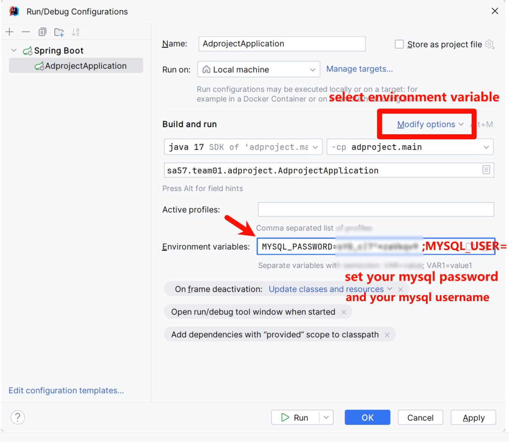

# HDB Insight backend application

## Overview

This application is using gradle as build tool and spring boot as framework. It is using the following dependencies:
- spring-boot-starter-data-jpa
- spring-boot-starter-validation
- spring-boot-starter-web
- spring-session-core

## How to run

### Prerequisite
Set up a mysql database with the following properties:
- database name: hdbinsight
- username: ${MYSQL_USER}
- password: ${MYSQL_PASSWORD}

### Set up environment variables

## Todo List

- [x] finish endpoints list
- [x] design the page
- [ ] implement the page
- [ ] implement the backend endpoints
- [ ] if you have time, add validation to entities
- [ ] if you have time, add unit tests

## REST API Endpoints

- `/api/property/salelist` - GET method, return a list of properties for sale
- `/api/property/rentlist` - GET method, return a list of properties for rent
- `/api/property/detail/{id}` - GET, return the detail of a property
- `/api/property/list/search - POST, search properties, return a list of properties
- `/api/user/details/{id}` - GET, return the detail of a user
- `/api/user/login` - POST, login a user
- `/api/user/logout` - POST, logout a user
- `/api/user/register` - POST, register a user
- `/api/user/update` - POST, update a user
- `/api/appointment/create` - POST, create an appointment
- Properties
- `/api/property/list`- GET method, return a list of properties 
- `/api/property/{id}`-GET, return the detail of a property

